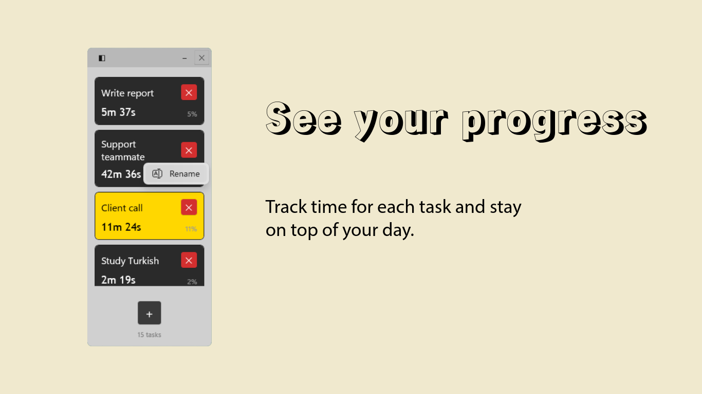
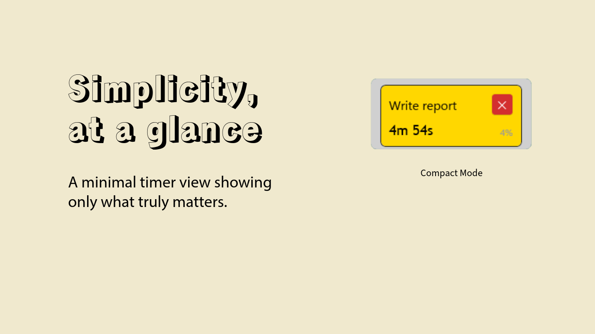

# Task Timer Widget

<p align="center">
  
</p>

<p align="center">
  <a href="https://opensource.org/licenses/MIT"></a>
  <a href="https://www.microsoft.com/windows"></a>
  <a href="https://dotnet.microsoft.com/"></a>
  <a href="https://microsoft.github.io/microsoft-ui-xaml/"></a>
</p>

<p align="center">
  <strong>A lightweight, minimal task timer widget for Windows 11.</strong><br>
  Manage your tasks and track time with a simple, distraction-free interface.
</p>

<p align="center">
  <a href="https://apps.microsoft.com/detail/9NF0N9LN349G">
    
  </a>
</p>

<p align="center">
  <a href="#-getting-started">Download</a> •
  <a href="#-features">Features</a> •
  <a href="docs/general/DEVELOPMENT.md">Documentation</a> •
  <a href="https://melihcelenk.github.io/TaskTimerWidget/PRIVACY_POLICY.html">Privacy Policy</a> •
  <a href="https://melihcelenk.github.io/TaskTimerWidget/">Website</a>
</p>

---

## 📸 Screenshots

<p align="center">
  
  
</p>

<p align="center">
  
</p>

<p align="center">
  <em>Left: Normal mode with multiple tasks • Right: Compact mode showing active task only • Bottom: Inline rename feature</em>
</p>

## 🎯 Features

- **Minimal Design**: Widget-sized window that doesn't take up much space
- **Task Management**: Create, delete, and manage multiple tasks
- **Built-in Timer**: Track elapsed time for each task
- **Active Task Highlighting**: Yellow highlight shows which task is currently active
- **Pause & Resume**: Click to pause/resume timer on any task
- **Persistent Storage**: Tasks are saved locally
- **Lightweight**: Minimal resource usage

## 🚀 Getting Started

### Prerequisites
- Windows 10/11 (Build 17763 or later)
- .NET 8.0 Runtime

### Installation

1. Clone or download the project
2. Open `src/TaskTimerWidget/TaskTimerWidget.csproj` in Visual Studio 2022
3. Build the project (Build > Build Solution)
4. Run the application (F5 or Debug > Start Debugging)

### Usage

1. **Add Task**: Click the `+` button to add a new task
2. **Name Task**: Enter the task name in the dialog and click Create
3. **Start Timer**: Click on a task to activate it and start the timer
4. **Pause Timer**: Click the active task again to pause the timer
5. **Switch Tasks**: Click another task to pause the current one and activate the new one
6. **Delete Task**: Click the `✕` button on a task to remove it

## 📁 Project Structure

```
TaskTimerWidget/
├── src/
│   └── TaskTimerWidget/
│       ├── Models/              # Data models (Task, etc.)
│       ├── ViewModels/          # MVVM ViewModels
│       ├── Services/            # Business logic services
│       ├── Helpers/             # Utility classes and converters
│       ├── Views/               # XAML UI files
│       ├── Assets/              # Images and resources
│       ├── App.xaml(.cs)        # Application entry point
│       └── TaskTimerWidget.csproj
├── docs/
│   ├── general/                 # General documentation
│   │   ├── DEVELOPMENT.md       # Development guide
│   │   ├── MARKET_RESEARCH.md   # Market analysis
│   │   ├── PRIVACY_POLICY.md    # Privacy policy
│   │   └── STORE_LISTING.md     # Store submission info
│   ├── tasks/TTW-1/             # Task-specific documentation
│   │   └── TODO.md              # Development roadmap
│   └── WINUI3_WINDOW_DRAGGING.md # WinUI 3 guide
├── legacy/                      # Old prototypes
├── CLAUDE.md                    # Code standards and guidelines
├── LICENSE                      # MIT License
└── README.md                    # This file
```

## 🏗️ Architecture

This project follows the **MVVM (Model-View-ViewModel)** pattern:

- **Models**: Pure data objects (Task.cs)
- **ViewModels**: Business logic and UI state management
- **Views**: XAML UI and code-behind
- **Services**: Data persistence and task management

## 🔧 Technology Stack

- **Framework**: .NET 8.0
- **UI**: WinUI 3
- **Logging**: Serilog
- **DI**: Microsoft.Extensions.DependencyInjection
- **Serialization**: System.Text.Json

## 📋 Development

### Building

```bash
dotnet build src/TaskTimerWidget/TaskTimerWidget.csproj
```

### Running

```bash
dotnet run --project src/TaskTimerWidget/TaskTimerWidget.csproj
```

### Code Standards

Please refer to [CLAUDE.md](./CLAUDE.md) for:
- Naming conventions
- Code style guidelines
- MVVM patterns
- Error handling standards
- Documentation requirements

### Development Guides and Resources

See [docs/general/DEVELOPMENT.md](./docs/general/DEVELOPMENT.md) for detailed development setup and guides, including:
- Setup instructions
- Project structure
- Development workflow
- **[WinUI 3 Custom Window Dragging Guide](./docs/WINUI3_WINDOW_DRAGGING.md)** - Applicable to all C# WinUI 3 projects

### Development Roadmap

See [docs/tasks/TTW-1/TODO.md](./docs/tasks/TTW-1/TODO.md) for the complete development roadmap with phases and milestones.

## 📊 Market Analysis

See [docs/general/MARKET_RESEARCH.md](./docs/general/MARKET_RESEARCH.md) for:
- Market analysis and competition
- Growth strategies
- Monetization plan
- Timeline and projections

## 🎯 Roadmap

### v1.0 (Current - Release Candidate) ✅
- [x] Core timer functionality
- [x] Task management (create, delete, rename, reorder)
- [x] Persistent storage
- [x] Compact mode
- [x] Always-on-top widget
- [x] Custom fonts and styling
- [x] Time percentage display
- [x] Drag-and-drop reordering
- [ ] Windows Store submission (in progress)
- [ ] MSIX packaging

### v2.0 (Planned)
- [ ] Cloud synchronization (OneDrive)
- [ ] Advanced statistics & reporting
- [ ] Multiple themes
- [ ] System tray integration
- [ ] Windows startup option
- [ ] Premium tier

### v3.0+ (Future)
- [ ] Team collaboration features
- [ ] Cross-platform (mobile apps)
- [ ] Integration ecosystem
- [ ] Enterprise features

## 📄 License

This project is licensed under the MIT License - see the [LICENSE](LICENSE) file for details.

**Why MIT?** This license allows you to:
- ✅ Use this software for any purpose (personal, commercial, educational)
- ✅ Modify and distribute the code
- ✅ Incorporate it into your own projects
- ✅ Sell software that includes this code

The only requirement is to include the copyright notice and license text.

## 👥 Contributing

Contributions are welcome! Please:
1. Follow the code standards in CLAUDE.md
2. Create a feature branch
3. Submit a pull request with description

## 📞 Support

For issues, questions, or suggestions, please:
1. Check existing issues
2. Create a new issue with detailed description
3. Include screenshots/logs if applicable

## 🙏 Acknowledgments

- Built with WinUI 3 and .NET 8.0
- Inspired by Toggl and other time-tracking tools
- Designed for productivity enthusiasts

---

**Version**: 1.0.0 (Release Candidate)
**Last Updated**: November 1, 2025
**Status**: Active Development → Public Release
**License**: MIT
